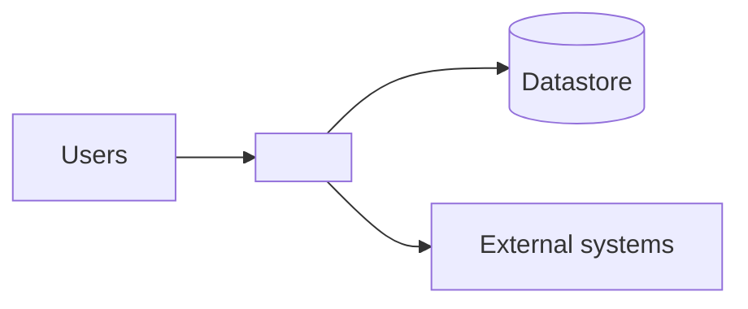

# Current Architecture

> **Last updated:** YYYY-MM-DD
> **Scope:** As-is architecture of <system>, and which parts of it this run examined
> **Mode:** full | code-only
> **Status:** <full: accepted knowledge unless flagged | code-only: code-derived, not validated by a person> — see ../_discovery/assumptions-register.md

<!-- As-is only. Describe how the system IS built, not how it should be. Keep to ~1–2 pages
plus one diagram. -->

## Overview

<2–4 sentences: style (monolith/services/etc.), primary stack, how it's driven, and the areas the
system divides into.>

## Context diagram

## Components

<!-- The parts a change would have to touch. What each is responsible for. A small table is ideal.

This file is where the component-to-area mapping is recorded, so the Area column is a glossary term,
not a namespace or folder name. Nothing else holds this mapping: the root README lists the areas but
not what's in them. Drop the column on a single-area system, which has no areas/ directory.

List every part the declared graph shows, read or not, since dropping one would misrepresent the
system. Flag the rows recon never read with [unchecked]. Without that, five services formatted
identically read as five services examined, and the one that was read is indistinguishable from the
four that weren't. -->

| Component | Area | Responsibility | Key tech |
|---|---|---|---|
| <name> | <the area it belongs to> | <what it does> | <framework/lib> |

## Data & persistence

<Datastores, what lives where. Point to `../domain/domain-model.md` for the entities.>

## Entry points & runtime

<How it runs: web app, workers, scheduled jobs, CLI. How requests/events flow in.>

## Cross-cutting concerns

<!-- SECRETS: this file is committed. Auth and config handling are exactly where credentials leak,
so re-read the secrets rule in `SKILL.md` before writing this section. -->

<Auth, logging/audit, error handling, config/secrets, caching: briefly, as-is.>

## Notable constraints & risks

<Tech debt, coupling, single points of failure a new joiner must know. Flag assumptions.>
