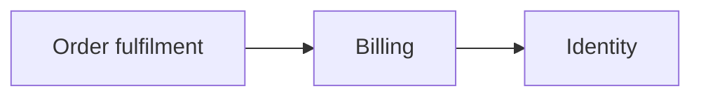
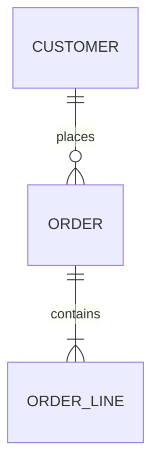
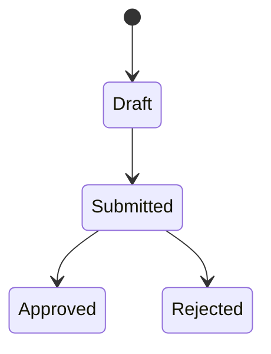

# Domain Model

> **Last updated:** YYYY-MM-DD
> **Scope:** Core domain entities and relationships of <system>
> **Mode:** full | code-only
> **Status:** <full: accepted knowledge unless flagged | code-only: code-derived, not validated by a person> — see <../ | ../../>_discovery/assumptions-register.md

<!-- The business entities and how they relate, not the raw DB schema. This template serves TWO
modes; delete the one you're not writing.

  SYSTEM LEVEL: domain/domain-model.md
    Aggregates, which area owns what, and the relationships that CROSS areas. Deliberately thin: no
    attribute lists, no lifecycles. Its job is showing how the areas fit together. Use the container
    diagram below and the ownership table; drop the entity and lifecycle sections.

  AREA LEVEL: areas/<area>/model-<concept>.md, one concept per file
    The entities, key attributes and lifecycles for that concept. Use the ER and state diagrams and
    the entity table; drop the container diagram. A second concept is a second file.
-->

## Area ownership (system level)

| Aggregate | Owned by area | Referenced by |
|---|---|---|
| <Invoice> | billing | fulfilment, reporting |

## Entity diagram (area level)

## Core entities (area level)

| Entity | Meaning | Key attributes | Related to |
|---|---|---|---|
| <name> | <what it represents in the business> | <notable fields> | <relationships> |

## Key lifecycles (area level)

<!-- For entities with a status/state, show the states and transitions. State machines are
where a lot of business rules live. -->

<Notes on what triggers each transition and who can cause it. Cross-link the rules-<concept>.md files
that govern these transitions, since state machines are where a lot of business rules live.>
