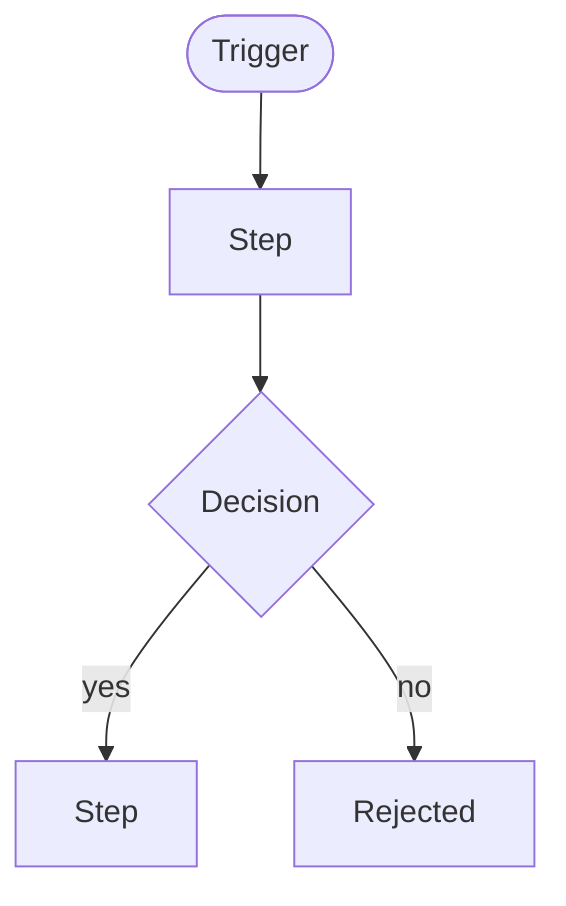

# <Workflow name>

> **Last updated:** YYYY-MM-DD
> **Scope:** The <workflow name> flow in <system>
> **Mode:** full | code-only
> **Status:** <full: accepted knowledge unless flagged | code-only: code-derived, not validated by a person> — see <../ | ../../>_discovery/assumptions-register.md

<!-- ONE FLOW PER FILE. Written as `workflow-<concept>.md`, inside areas/<area>/ when an area owns
it, or under business/ when it crosses areas. A second flow is a SECOND FILE, not another section
here.

NAMING: until a stakeholder confirms the flow is what the business calls it, name the file after the
code entry point it starts from and mark it [unverified] in the scope line. Once confirmed, rename to
the glossary term (workflow-invoice-run.md) and drop the flag.

Only the flows that matter for onboarding, not every code path. -->

**Actors:** <who> · **Trigger:** <what starts it> · **Outcome:** <what success looks like>

- **Decision points:** <what determines each branch>
- **Unhappy paths:** <errors, timeouts, rejections, retries>
- **Hand-offs / approvals:** <where a human or another system takes over>
- **Timing / SLAs:** <cut-offs, deadlines, or [assumption] if unknown>
- **Rules that govern it:** <link the rules-<concept>.md files this flow depends on>
