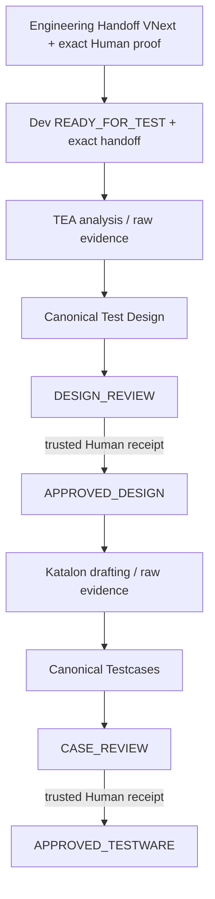

# Test Kit VNext: workflow, authority và Human Gate

Validator `PASS` không tạo Human approval. `REQUEST_CHANGES` tạo revision mới, giữ lại bytes và evidence revision cũ. `APPROVED_TESTWARE` là terminal của Manual lane, không phải execution status.

Trong lifecycle tích hợp, Test nhận feature sau Dev READY_FOR_TEST. Engineering Handoff vẫn là business authority WHAT; Dev Handoff mang technical context và không thay WHAT.

## Authority từng bước

| Nguồn/trạng thái | Runtime xác thực | Authority |
|---|---|---|
| Engineering Handoff VNext | BA handoff, exact Human receipt, baseline candidate, source revision/hash, callback byte recheck | Business WHAT |
| Canonical Design | Exact BR/FR refs, BA source context, current authority refs | Test coverage proposal; chưa được approve tại `DESIGN_REVIEW` |
| Human Design Gate | Actor authentication, exact artifact ID/revision/hash và input refs | Chỉ Human cấp `APPROVED_DESIGN` |
| Dev Handoff V2 trong integrated suite | Exact technical handoff ở READY_FOR_TEST, bound về cùng BA handoff | Technical context; không thay WHAT |
| UX context (optional) | Explicit `ux_required`, approved contract/receipt, feature/revision, source/snapshot hashes, Human auth và recheck bytes | UX context đã được phê duyệt; prototype vẫn `REVIEW_EVIDENCE` |
| Canonical Testcases | Exact approved Design refs, BR/FR-only trace, execution dependencies | Manual cases; chưa được approve tại `CASE_REVIEW` |
| Human Case Gate | Actor authentication, exact testcase ID/revision/hash và current refs | Chỉ Human cấp `APPROVED_TESTWARE` |

BA baseline là business oracle. Approved Design là coverage input. Approved execution/interface contract, nếu có, là execution oracle có phạm vi riêng. TEA, Katalon, Project Test Policy và implementation không cấp approval.

## Test Design và Testcase

Canonical Test Design gồm ID, priority, scenario title, expected behavior, `BR/FR` requirement refs và open questions. Không đặt `BAREF:*` vào canonical trace; unresolved BA behavior giữ nguyên UNKNOWN.

Canonical testcase gồm ID, name, objective, preconditions, test data, steps, priority, Design refs, `BR/FR` refs và execution dependencies. Required dependency còn unresolved sẽ chặn Case approval. Human review chịu trách nhiệm semantic consistency giữa nội dung tự do và nguồn; runtime không giả vờ xác minh NLP entailment.

## V1 và projections

V1 artifact chỉ được inspect như `LEGACY_COMPAT` với `vnext_authority=false`. Không có V1 migration nào tạo BA, UX, Design, Case hay execution approval.

XMind là projection một chiều từ `APPROVED_DESIGN`; Excel là projection một chiều từ `APPROVED_TESTWARE`. Không import ngược. Delivery Manifest là `DEFERRED_NON_AUTHORITATIVE`, không cần cho Test VNext. Automation V1 tiếp nhận `APPROVED_TESTWARE` và tạo `EXECUTION_READY`; [Test Execution VNext](TEST_EXECUTION_VNEXT.md) sở hữu execution, Finding, Defect handoff, retest và Tester-owned `VERIFIED`.
