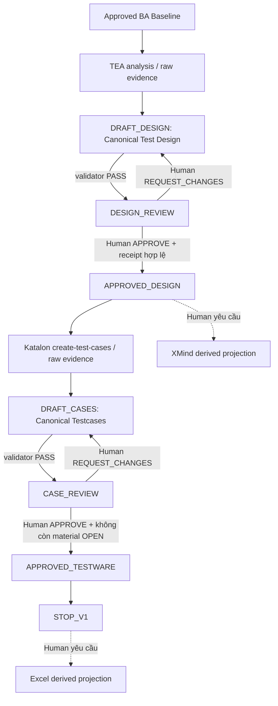

# Test Kit V1.1: workflow, authority và Human Gate

Test Kit bắt đầu từ **approved BA baseline**. Không phải Dev Kit output mới mở được luồng này. Agent chịu trách nhiệm chuyển đổi, phân tích, lưu evidence và validate; Human chịu trách nhiệm review, giải quyết business question và phê duyệt chính xác revision của artifact.



`REQUEST_CHANGES` tạo revision draft mới và giữ evidence của snapshot cũ. Diagram rút gọn vòng lặp; runtime không quay về cùng revision để âm thầm sửa đè. `APPROVED_TESTWARE` là artifact được tạo khi Case Gate hợp lệ; `STOP_V1` là trạng thái workflow terminal.

## Authority theo từng bước

| Bước | Agent được làm | Human sở hữu | Artifact/điều kiện |
|---|---|---|---|
| Approved BA input | Kiểm tra handoff và SHA-256 của BR/SRS/decisions | BA quyết định business behavior | `APPROVED_FOR_ENGINEERING` |
| TEA | Phân tích, giữ raw output và source map | Review coverage/UNKNOWN | Chưa có approval |
| `DRAFT_DESIGN` → `DESIGN_REVIEW` | Chuẩn hóa/validate exact canonical collection | Review, hỏi lại, yêu cầu sửa | Validator `PASS` gắn ID/revision/hash |
| `DESIGN_REVIEW` → `APPROVED_DESIGN` | Kiểm tra và lưu receipt | `APPROVE` hoặc `REQUEST_CHANGES` | Authenticated Human, exact BA refs |
| Katalon | Tạo raw manual cases từ approved Design | Giải quyết execution contract khi cần | Chỉ sau Design Gate |
| `DRAFT_CASES` → `CASE_REVIEW` | Chuẩn hóa/validate trace, step và dependency | Review testcase và blockers | Validator `PASS` gắn exact collection |
| `CASE_REVIEW` → `STOP_V1` | Kiểm tra và lưu receipt/testware | `APPROVE` hoặc `REQUEST_CHANGES` | Không có material OPEN dependency |

BA baseline là **business oracle**; approved Design là **coverage oracle**; approved execution/interface contract là **execution oracle**; Project Test Policy V1.1 chỉ là **non-authoritative testing guidance**. Current code chỉ là supplemental evidence. P0–P3, TEA risk và Katalon wording không cấp business authority. XMind/Excel là derived presentation, không thay đổi trạng thái.

## Human Gate: các từ dễ nhầm

| Hành động | Tác dụng |
|---|---|
| `ANSWER` | Trả lời câu hỏi BA/execution; **không** phê duyệt artifact |
| `REVIEW` | Đọc và báo finding; không mutate, không advance |
| `REQUEST_CHANGES` | Từ chối revision hiện tại, ghi feedback và mở revision mới |
| `CONTINUE`, “Next”, “OK”, “PASS” | Yêu cầu xem bước hợp lệ tiếp theo; **không** là approval |
| `APPROVE` | Human chấp nhận **artifact/revision cụ thể** nếu receipt, validator và input refs hợp lệ |

Agent, TEA, Katalon và validator không tự approve. Human nói “APPROVE” cũng chưa đủ nếu host không xác thực Human và lưu receipt cho exact snapshot. Receipt có `gate`, `decision`, `artifact_id`, `artifact_revision`, `artifact_sha256`, `input_refs`, `actor_id`, `actor_role`, `decided_at`, `feedback`. Design Gate dùng BA refs và DESIGN policy ref khi project có policy; Case Gate dùng BA refs, approved Design ref và CASES policy ref. Policy/evidence đổi sau review làm receipt stale và approval fail closed. `REQUEST_CHANGES` cần feedback và revision mới. Replay, stale hash, sai gate, Agent actor và input đổi đều bị từ chối, không advance state.

## Canonical Test Design

Một row chuẩn là:

```text
design_id
hierarchy_path           # thứ tự heading từ nguồn TEA
scenario_title
expected_behavior        # string hoặc null khi outcome BA được nêu rõ là UNKNOWN
requirement_refs         # FR/BR đã duyệt, có thứ tự
open_questions           # {source_ref, text, status: UNKNOWN}
review_status            # DRAFT / IN_REVIEW / CHANGES_REQUESTED / APPROVED
```

`expected_behavior: null` chỉ hợp lệ với open question liên quan. Scenario deferred vẫn hiển thị để Human thấy lỗ hổng; không xuất pass/fail assertion giả. Priority heading của TEA nằm trong `hierarchy_path`/raw evidence, **không** là semantic field của Canonical Test Design. `review_status` là projection của gate, không nằm trong immutable semantic payload.

## Canonical Testcase

```text
test_case_id, name, objective, preconditions, test_data,
steps: [{action, test_data, expected_result}], priority,
requirement_refs, test_design_refs,
execution_dependencies: [{need, material, status, resolution_ref}],
review_status
```

`steps` có thứ tự. Case-level `test_data` không tự phát xuống từng step; step-level `test_data` chỉ có nếu nguồn ghi rõ. `priority` chỉ là P0–P3 advisory. `requirement_refs` truy BA; `test_design_refs` truy exact approved Design. `execution_dependencies` ghi rõ thiếu contract nào để setup, thao tác hoặc quan sát được; material `OPEN` chặn Case Gate approval. Đây không phải quyền invent thêm BA behavior.

## Khi nào workflow dừng hoặc quay lại?

- Approved BA handoff thiếu/sai hash hoặc business behavior chưa được BA quyết định: dừng, giữ `UNKNOWN`; không tạo expected result tùy đoán.
- TEA/Katalon output không thể chuẩn hóa, thiếu field/ID/ref/step hoặc authority mâu thuẫn: `CANNOT_NORMALIZE`/validator finding; không submit gate.
- Design chưa `APPROVED_DESIGN`: không chạy production testcase generation hay XMind production export.
- Case còn material `OPEN` execution dependency: Human có thể review/yêu cầu sửa, nhưng `APPROVE` bị từ chối và state vẫn `CASE_REVIEW`.
- BA/Design revision, policy snapshot hoặc input SHA đổi: receipt cũ không được dùng; cần revalidate/review artifact bị ảnh hưởng.
- `STOP_V1`: không tự chạy Playwright/API, không sinh execution evidence hay defect triage. Các phần này thuộc Automation Test V2.

## Nơi lưu output và TEST_ONLY

Caller/host chọn **run directory thuộc project** cho feature. Test Kit ghi raw invocation, canonical semantic payload, source map, validation findings, `workflow-state.json`, receipts và approved testware trong run đó. Production output chỉ hợp lệ khi host xác thực Human.

`TEST_ONLY` là API/fixture path tách biệt cho kiểm thử framework; receipt mô phỏng và `not_for_production: true` không phải approval cho dự án thật. XMind/Excel output đặt tại output directory caller chọn, có manifest truy vết bên ngoài. Thay đổi semantics phải sửa canonical revision rồi qua gate phù hợp; V1 không có reverse import.

Xem [Quick Start](TEST_KIT_QUICKSTART.md) · [Project Customization](TEST_KIT_CUSTOMIZATION.md) · [Khả năng](TEST_KIT_CAPABILITIES.md) · [Usage Guide](TEST_KIT_USAGE_GUIDE.md) · [CR-001](../../kits/test/examples/CR-001/README.md).
