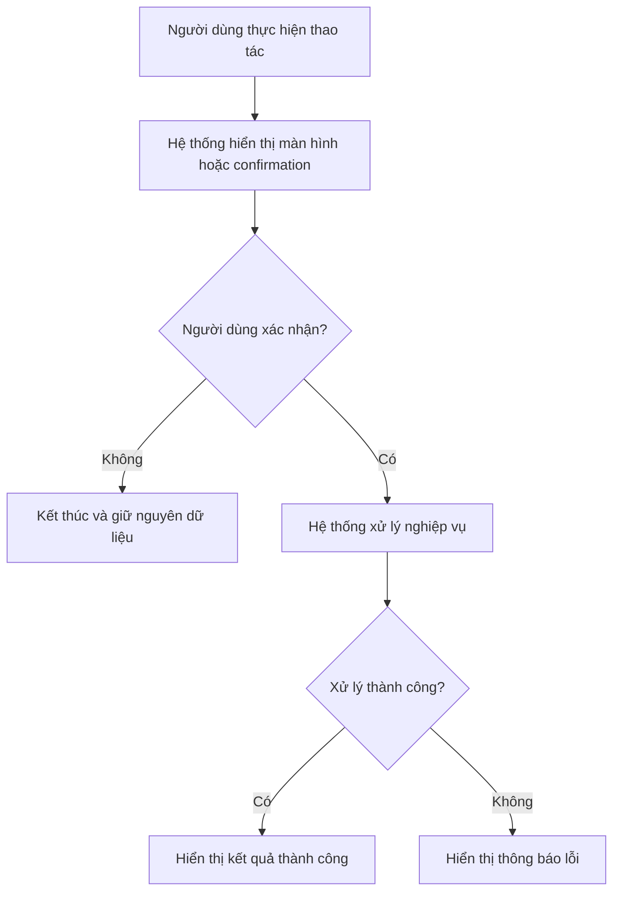

# SRS Function Document Skill

## 1. Mục đích

Skill này được sử dụng khi người dùng yêu cầu:

- Viết mới tài liệu đặc tả cho một chức năng.
- Chuẩn hóa nội dung nghiệp vụ thô thành tài liệu SRS.
- Bổ sung hoặc chỉnh sửa một chức năng trong tài liệu hiện có.
- Chuyển mô tả nghiệp vụ, ảnh giao diện, API, source code hoặc ghi chú thành tài liệu có cùng cấu trúc chuẩn.

Kết quả phải bám sát format sau:

1. Thông tin chung về chức năng.
2. Luồng nghiệp vụ.
3. Mô tả chi tiết nghiệp vụ theo Business Rule.
4. Thiết kế giao diện.
5. Mô tả chi tiết thành phần giao diện.

Không tự ý thay đổi cấu trúc, tên mục hoặc thứ tự các cột trong bảng nếu người dùng không yêu cầu.

---

## 2. Vai trò và phạm vi của skill

Skill này là công cụ hỗ trợ BA chuẩn hóa và đặc tả tài liệu. Skill không thay thế BA trong việc phân tích nghiệp vụ, trao đổi với stakeholder hoặc quyết định requirement.

Khi làm việc với project brownfield, skill có thể sử dụng source code, tài liệu hiện tại, API, database mapping, giao diện và các artifact trong project để hiểu **hiện trạng hệ thống**. Tuy nhiên:

- Hiện trạng hệ thống không mặc nhiên trở thành requirement mới.
- Convention đang tồn tại chỉ được dùng làm context hoặc đề xuất để BA xác nhận.
- Không được tự thiết kế solution chỉ vì source code hiện tại có pattern tương tự.
- Nếu có mâu thuẫn giữa BA input và current system, phải nêu rõ mâu thuẫn và yêu cầu xác nhận.

### 2.1. Phân loại evidence bắt buộc

Khi tổng hợp thông tin từ nhiều nguồn, phải phân biệt:

- `CONFIRMED`: Nội dung được BA/người dùng cung cấp hoặc xác nhận trực tiếp.
- `CURRENT_SYSTEM`: Hành vi hoặc cấu trúc được kiểm chứng từ source code, API, CSDL, tài liệu hoặc giao diện hiện tại.
- `INFERRED`: Nội dung có thể suy luận hợp lý nhưng chưa được BA xác nhận.
- `PROPOSED`: Đề xuất áp dụng convention hoặc behavior dựa trên hiện trạng project.
- `UNKNOWN`: Không đủ dữ liệu để kết luận.

Quy tắc sử dụng:

- Chỉ `CONFIRMED` mới được viết thành requirement mới mà không cần qualifier.
- `CURRENT_SYSTEM` chỉ mô tả hiện trạng hoặc dùng làm context đối chiếu.
- `INFERRED` và `PROPOSED` phải được BA xác nhận trước khi trở thành requirement.
- `UNKNOWN` phải chuyển thành `TBD` hoặc câu hỏi cần xác nhận.

Ví dụ:

```text
CURRENT_SYSTEM:
Các màn hình danh sách tương tự đang sử dụng phân trang 20 bản ghi/trang.

ĐÚNG:
"Các màn hình tương tự hiện sử dụng 20 bản ghi/trang. Có áp dụng convention này cho chức năng mới không?"

SAI:
"Màn hình hiển thị 20 bản ghi/trang."
```

### 2.2. Review trước khi viết SRS

Nếu đầu vào là requirement thô hoặc change request cho project brownfield, phải review completeness trước khi viết bản SRS hoàn chỉnh.

Chỉ kiểm tra các nhóm phù hợp với chức năng, ví dụ:

- Actor và permission.
- Trigger.
- Điều kiện trước và điều kiện sau.
- Main flow, alternate flow, exception flow.
- Dữ liệu đầu vào/đầu ra.
- Validation.
- Business Rule.
- Search/filter.
- Sorting.
- Pagination.
- Action trên danh sách hoặc từng bản ghi.
- Empty/loading/error state.
- Permission/unauthorized state.
- Time/date semantics.
- Concurrency hoặc conflict rule nếu liên quan.
- Lifecycle/status nếu liên quan.
- Message.
- Hành vi sau khi xử lý thành công/thất bại.

Không hỏi checklist một cách máy móc. Chỉ hỏi những điểm thực sự ảnh hưởng tới business behavior hoặc nội dung SRS.

Nếu thiếu thông tin ảnh hưởng trực tiếp tới logic:

1. Ghi rõ finding.
2. Nếu current project có convention liên quan, nêu convention làm context.
3. Đưa ra câu hỏi ngắn gọn cho BA.
4. Không tự trả lời câu hỏi.
5. Không viết bản SRS hoàn chỉnh cho phần chưa được xác nhận, trừ khi người dùng yêu cầu rõ một bản draft có `TBD`.

---

## 3. Nguyên tắc bắt buộc

### 3.1. Không tự suy diễn nghiệp vụ

- Không tự tạo quyền, message, API, bảng CSDL, điều kiện hoặc Business Rule chưa được cung cấp.
- Không coi giả định là yêu cầu đã xác nhận.
- Nội dung chưa đủ phải đánh dấu rõ là `TBD` hoặc hỏi lại người dùng.
- Chỉ dùng `N/A` khi nội dung thực sự không áp dụng.

### 3.2. Giữ nguyên thuật ngữ hệ thống

- Giữ nguyên tên menu, màn hình, button, permission, trạng thái, message và tên nghiệp vụ do người dùng cung cấp.
- Message hiển thị trên giao diện phải đặt trong dấu ngoặc kép.
- Không tự dịch tên kỹ thuật hoặc tên màn hình nếu hệ thống đang sử dụng tiếng Anh.

### 3.3. Giữ đúng numbering

- Phải giữ nguyên số mục cha do người dùng cung cấp.
- Các mục con mặc định được sinh theo cấu trúc:
  - `<section>.1` Thông tin chung về chức năng.
  - `<section>.2` Luồng nghiệp vụ.
  - `<section>.3` Thiết kế giao diện (nếu có).
- Nếu người dùng đã chỉ định numbering khác, ưu tiên numbering của người dùng.

Ví dụ:

```text
3.2.1.4     Chức năng xóa rule 4G
3.2.1.4.1   Thông tin chung về chức năng
3.2.1.4.2   Luồng nghiệp vụ
3.2.1.4.3   Thiết kế giao diện (nếu có)
```

### 3.4. Văn phong

- Viết theo văn phong đặc tả nghiệp vụ, rõ ràng, khách quan, không hội thoại.
- Mỗi câu mô tả một hành vi hoặc một điều kiện cụ thể.
- Sử dụng nhất quán các chủ thể:
  - `Người dùng` cho thao tác của actor.
  - `Hệ thống` cho xử lý và phản hồi của phần mềm.
- Tránh các từ mơ hồ như: “có thể”, “thường”, “tương đối”, “phù hợp”, trừ khi đó là yêu cầu nghiệp vụ.

---

## 4. Thông tin đầu vào cần thu thập

Trước khi viết tài liệu, cần xác định tối thiểu các thông tin sau:

1. Số mục và tên chức năng.
2. Mô tả mục đích chức năng.
3. Tác nhân và quyền cần có.
4. Trigger bắt đầu chức năng.
5. Điều kiện trước.
6. Điều kiện sau.
7. Luồng xử lý chính.
8. Luồng thay thế.
9. Luồng ngoại lệ.
10. Các Business Rule.
11. Message hiển thị.
12. Thành phần giao diện.
13. Mapping CSDL nếu có.
14. Ảnh màn hình hoặc mô tả giao diện nếu có.
15. Biểu đồ hoặc dữ liệu đủ để dựng biểu đồ nếu có.
16. Project context liên quan nếu đây là chức năng bổ sung/chỉnh sửa trên hệ thống hiện hữu.
17. Các chức năng/màn hình/API/model tương tự trong current system nếu cần dùng làm evidence.
18. Các điểm BA đã xác nhận khác với hành vi hiện tại của hệ thống nếu có.

Nếu làm việc với project brownfield, chỉ inspect các vùng source/tài liệu liên quan trực tiếp đến chức năng. Không scan toàn bộ repository một cách máy móc nếu không cần thiết.

Nếu thiếu dữ liệu làm thay đổi nghiệp vụ, phải hỏi lại trước khi chốt tài liệu. Các câu hỏi cần được gom nhóm, ngắn gọn và chỉ hỏi những nội dung chưa thể suy ra an toàn.

Ví dụ nhóm câu hỏi:

```text
Để hoàn thiện tài liệu, cần xác nhận thêm:
1. Quyền thực hiện chức năng là quyền nào?
2. Khi xử lý thất bại, hệ thống hiển thị message gì?
3. Bản ghi được xóa cứng hay xóa mềm?
4. Có kiểm tra ràng buộc dữ liệu trước khi xóa không?
5. Sau khi thành công, hệ thống giữ nguyên trang hiện tại hay quay về trang đầu?
```

---

## 5. Format đầu ra bắt buộc

# `<SỐ_MỤC>` `<TÊN_CHỨC_NĂNG>`

## `<SỐ_MỤC>.1` Thông tin chung về chức năng

| Nội dung | Mô tả |
|---|---|
| Mô tả | `<Mô tả ngắn gọn mục đích của chức năng>` |
| Tác nhân | Người dùng có quyền dưới đây:<br> `<Tên quyền> (<permission_code>)` |
| Trigger | `<Hành động trực tiếp làm bắt đầu chức năng>` |
| Điều kiện trước |  `<Điều kiện 1>`<br> `<Điều kiện 2>`<br> `<Điều kiện 3>` |
| Điều kiện sau | `<Trạng thái hệ thống hoặc dữ liệu sau khi xử lý thành công>` |
| Luồng ngoại lệ | `<N/A hoặc mô tả tham chiếu tới luồng ngoại lệ>` |
| Luồng thay thế | `<N/A hoặc mô tả tham chiếu tới luồng thay thế>` |

### Quy tắc viết phần thông tin chung

- `Mô tả`: bắt đầu bằng “Chức năng cho phép người dùng...”.
- `Trigger`: mô tả đúng thao tác cuối cùng kích hoạt nghiệp vụ.
- `Điều kiện trước`: chỉ chứa điều kiện phải đúng trước khi bắt đầu chức năng.
- `Điều kiện sau`: mô tả kết quả thành công, bao gồm thay đổi dữ liệu và thay đổi hiển thị nếu có.
- Không đưa chi tiết xử lý từng bước vào phần này.

---

## `<SỐ_MỤC>.2` Luồng nghiệp vụ

### Biểu đồ luồng nghiệp vụ

`<Biểu đồ ở đây>`

Khi người dùng yêu cầu sinh biểu đồ và dữ liệu đã đủ, ưu tiên biểu đồ activity bằng Mermaid:



Không sinh biểu đồ chung chung nếu luồng thực tế chưa được xác nhận.

### Mô tả chi tiết nghiệp vụ

| STT | Business Rule | Mô tả chi tiết |
|---:|---|---|
| (1) |  | `<Bước khởi tạo hoặc thao tác bắt đầu của người dùng>` |
| (2) | BR 01 | `<Quy tắc nghiệp vụ thứ nhất>` |
| (3) | BR 02 | `<Quy tắc nghiệp vụ thứ hai>` |

### Quy tắc viết luồng nghiệp vụ

- `STT` phải khớp với số bước trên biểu đồ nếu biểu đồ có đánh số.
- Business Rule phải đặt tên tuần tự: `BR 01`, `BR 02`, `BR 03`...
- Một Business Rule chỉ mô tả một nhóm quy tắc có cùng mục đích.
- Mỗi nhánh xử lý phải nêu rõ:
  - Điều kiện kích hoạt.
  - Hành động của người dùng.
  - Xử lý của hệ thống.
  - Kết quả hoặc trạng thái kết thúc.
- Khi có button xác nhận, phải mô tả riêng từng lựa chọn.

Ví dụ:

```text
Quy tắc hiển thị confirmation message:
Hệ thống hiển thị thông báo “Do you want to delete this rule?”.
 Ấn “Cancel”: Hệ thống đóng popup xác nhận, không thay đổi dữ liệu và giữ nguyên màn hình danh sách hiện tại.
 Ấn “Delete”: Hệ thống tiếp tục thực hiện xử lý xóa rule.
```

### Quy tắc mô tả xóa dữ liệu

Khi chức năng là xóa, phải làm rõ tối thiểu:

- Xóa cứng hay xóa mềm.
- Có kiểm tra dữ liệu liên quan hay không.
- Có cần xác nhận trước khi xóa hay không.
- Kết quả hiển thị sau khi xóa.
- Message thành công.
- Message thất bại.
- Cách xử lý khi bản ghi đã bị xóa hoặc không còn tồn tại.

Không tự mặc định xóa cứng hoặc xóa mềm.

---

## `<SỐ_MỤC>.3` Thiết kế giao diện (nếu có)

`<Ảnh màn hình ở đây>`

**MH. `<TÊN_MÀN_HÌNH>`**

### Mô tả chi tiết thành phần theo giao diện

| STT | Tên | Kiểu dữ liệu<br>[Độ dài dữ liệu] | Bắt buộc<br>(Y/N) | Input/Output | Giá trị khởi tạo | Mô tả (Mapping với CSDL nếu có) |
|---:|---|---|:---:|---|---|---|
| 1 | `[Message]` | Text | N | Output | - | Hiển thị message: “`<Nội dung message>`” |
| 2 | `Cancel` | Button | N | Input | Enabled | Luôn luôn enabled.<br>Click “Cancel” ⇒ `<Kết quả xử lý>` |
| 3 | `Delete` | Button | N | Input | Enabled | Luôn luôn enabled.<br>Click “Delete” ⇒ `<Kết quả xử lý>` |

### Quy tắc mô tả thành phần giao diện

- `Tên`: ghi đúng label hiển thị hoặc tên quy ước `[Message]`.
- `Kiểu dữ liệu`: sử dụng các giá trị như `Text`, `Button`, `Textbox`, `Dropdown`, `Checkbox`, `Radio`, `Date`, `Datetime`, `Table`, `Icon`.
- `Bắt buộc`: chỉ dùng `Y` hoặc `N`.
- `Input/Output`:
  - `Input`: người dùng có thể tương tác hoặc nhập dữ liệu.
  - `Output`: hệ thống chỉ hiển thị.
  - `Input/Output`: thành phần vừa hiển thị vừa cho phép thay đổi.
- `Giá trị khởi tạo`: ghi trạng thái hoặc giá trị ban đầu như `Enabled`, `Disabled`, `Unchecked`, `Empty`, giá trị mặc định hoặc `-`.
- `Mô tả`: phải bao gồm hành vi, validation, message và mapping CSDL nếu có.
- Button hoặc icon có thao tác phải mô tả rõ kết quả khi click.

---

## 6. Cách xử lý dữ liệu thiếu

### 6.1. Thiếu dữ liệu nhưng vẫn có thể tạo bản nháp

Có thể sử dụng `TBD` cho các trường chưa xác nhận:

```text
| Luồng ngoại lệ | TBD — Chưa có thông tin về xử lý khi hệ thống xóa thất bại. |
```

Phải bổ sung mục cuối tài liệu:

```text
### Nội dung cần xác nhận

1. Message hiển thị khi xóa thành công.
2. Message hiển thị khi xóa thất bại.
3. Cơ chế xóa cứng hay xóa mềm.
```

### 6.2. Thiếu dữ liệu ảnh hưởng trực tiếp đến logic

Phải hỏi lại trước khi viết bản hoàn chỉnh trong các trường hợp:

- Chưa rõ actor hoặc permission.
- Chưa rõ dữ liệu được tạo, sửa, xóa theo cách nào.
- Chưa rõ nhánh thành công và thất bại.
- Chưa rõ validation quan trọng.
- Chưa rõ message bắt buộc phải hiển thị chính xác.
- Có mâu thuẫn giữa mô tả nghiệp vụ, giao diện, API hoặc CSDL.
- Current system có behavior/convention liên quan nhưng chưa rõ BA muốn reuse hay thay đổi.
- Có suy luận từ source code nhưng chưa có bằng chứng rằng đó là requirement mong muốn.
- Requirement dùng thuật ngữ nghiệp vụ mới nhưng project hiện có khái niệm gần giống và chưa rõ quan hệ giữa hai khái niệm.

Khi rơi vào các trường hợp trên, phải đưa câu hỏi cho BA và không tự chọn phương án.

---

## 7. Quy tắc chuẩn hóa nội dung người dùng cung cấp

Khi người dùng gửi nội dung thô:

1. Xác định action chính: xem, thêm, sửa, xóa, duyệt, từ chối, import, export, tìm kiếm hoặc cấu hình.
2. Xác định đối tượng nghiệp vụ.
3. Xác định actor và permission.
4. Tách điều kiện trước khỏi các bước xử lý.
5. Tách kết quả thành công khỏi message hiển thị.
6. Chia logic thành các Business Rule độc lập.
7. Mapping từng thành phần UI với Business Rule liên quan.
8. Kiểm tra tính nhất quán giữa:
   - Tên chức năng.
   - Tên màn hình.
   - Tên button.
   - Message.
   - Quyền.
   - Đối tượng dữ liệu.
9. Liệt kê các điểm chưa xác nhận, không tự điền.
10. Nếu sử dụng current project làm context:
    - Ghi nhận rõ behavior nào là `CURRENT_SYSTEM`.
    - Không tự nâng behavior hiện tại thành requirement mới.
    - Nếu muốn reuse convention, ghi dưới dạng `PROPOSED` và yêu cầu BA xác nhận.
11. Nếu có nhiều nguồn đầu vào, ưu tiên:
    - Nội dung BA đã xác nhận.
    - Requirement/change request chính thức.
    - Artifact nghiệp vụ đã được duyệt.
    - Current-system evidence.
    - Suy luận/đề xuất.
12. Nếu các nguồn mâu thuẫn, không tự hòa giải; phải nêu rõ conflict và yêu cầu xác nhận.

---

## 8. Checklist kiểm tra chất lượng

Trước khi trả kết quả, phải tự kiểm tra:

- [ ] Numbering đúng với mục cha.
- [ ] Tên chức năng nhất quán trong toàn bộ tài liệu.
- [ ] Actor và permission đã được nêu rõ.
- [ ] Trigger là một hành động cụ thể.
- [ ] Điều kiện trước không chứa bước xử lý.
- [ ] Điều kiện sau mô tả đúng trạng thái thành công.
- [ ] Luồng thay thế và luồng ngoại lệ được ghi rõ hoặc là `N/A`.
- [ ] Các bước nghiệp vụ có thứ tự hợp lý.
- [ ] Business Rule được đánh số liên tục.
- [ ] Mỗi button hoặc nhánh xác nhận đều có kết quả rõ ràng.
- [ ] Message được đặt trong dấu ngoặc kép và giữ nguyên nội dung.
- [ ] Thành phần UI dùng đúng kiểu dữ liệu.
- [ ] Trường bắt buộc chỉ sử dụng `Y` hoặc `N`.
- [ ] Input/Output được xác định đúng.
- [ ] Không tự tạo mapping CSDL.
- [ ] Không tự giả định xóa cứng hoặc xóa mềm.
- [ ] Không còn mâu thuẫn giữa luồng nghiệp vụ và giao diện.
- [ ] Các dữ liệu chưa rõ được đánh dấu `TBD` hoặc đưa vào phần cần xác nhận.
- [ ] Current-system behavior không bị biến thành requirement mới nếu chưa có BA xác nhận.
- [ ] Mọi suy luận hoặc đề xuất quan trọng đều được nhận diện là `INFERRED` hoặc `PROPOSED`.
- [ ] Không còn conflict chưa được nêu rõ giữa BA input và current system.
- [ ] Các câu hỏi mở chỉ tập trung vào nội dung ảnh hưởng tới business behavior/SRS.
- [ ] Nếu có diagram, nội dung diagram không mâu thuẫn với Business Rule và mô tả textual.
- [ ] Nếu có UI specification, behavior của từng control/action nhất quán với luồng nghiệp vụ.
- [ ] Không tự thiết kế API, database schema hoặc technical solution ngoài phạm vi requirement.

---

## 9. Mẫu lệnh sử dụng skill

### Viết mới từ mô tả thô

```text
Sử dụng skill srs-function-document để viết chức năng 3.2.1.4 “Xóa rule 4G”.
Giữ đúng format SRS, tạo bảng đầy đủ, không tự suy diễn nội dung chưa có.
Dữ liệu đầu vào:
...
```

### Chuẩn hóa tài liệu có sẵn

```text
Sử dụng skill srs-function-document để chuẩn hóa nội dung dưới đây.
Giữ nguyên nghiệp vụ, message và numbering. Chỉ sửa cách trình bày, tính nhất quán và bổ sung danh sách nội dung cần xác nhận.
...
```

### Xây dựng tài liệu từ ảnh và mô tả

```text
Sử dụng skill srs-function-document để xây dựng đặc tả chức năng từ ảnh giao diện và mô tả nghiệp vụ đính kèm.
Hãy bóc tách thành phần giao diện, đối chiếu với luồng nghiệp vụ và hỏi lại những thông tin không thể xác định an toàn.
```

### Xây dựng SRS cho project brownfield

```text
Sử dụng skill srs-function-document để review và xây dựng SRS cho change request dưới đây.

Trước khi viết SRS:
1. Đọc project context và các vùng source liên quan.
2. Phân biệt CONFIRMED với CURRENT_SYSTEM/INFERRED/PROPOSED/UNKNOWN.
3. Liệt kê gap và câu hỏi cần BA xác nhận.
4. Không biến convention hiện tại thành requirement mới.

Chỉ viết bản SRS hoàn chỉnh sau khi các gap ảnh hưởng trực tiếp tới nghiệp vụ đã được xác nhận.
```

---

## 10. Mẫu đầu ra tham chiếu

# 3.2.1.4 Chức năng xóa rule 4G

## 3.2.1.4.1 Thông tin chung về chức năng

| Nội dung | Mô tả |
|---|---|
| Mô tả | Chức năng cho phép người dùng xóa rule chặn/mở thuê bao roaming 4G. |
| Tác nhân | Người dùng có quyền dưới đây:<br> Quyền quản lý rule (`manage_rule`) |
| Trigger | Người dùng click icon xóa tại cột Action của rule tương ứng. |
| Điều kiện trước |  Người dùng đã đăng nhập vào hệ thống.<br> Người dùng hover vào menu “Config” và chọn “LTE”.<br> Người dùng click chọn menu “LTE Rule config”. |
| Điều kiện sau | Rule chặn/mở thuê bao roaming 4G được xóa thành công và không còn hiển thị trên màn hình danh sách. |
| Luồng ngoại lệ | N/A |
| Luồng thay thế | Người dùng chọn “Cancel” tại popup xác nhận xóa. Hệ thống kết thúc xử lý, không thay đổi dữ liệu và giữ nguyên màn hình danh sách hiện tại. |

## 3.2.1.4.2 Luồng nghiệp vụ

### Biểu đồ luồng nghiệp vụ

`<Biểu đồ ở đây>`

### Mô tả chi tiết nghiệp vụ

| STT | Business Rule | Mô tả chi tiết |
|---:|---|---|
| (1) |  | Người dùng click icon xóa tại cột Action của rule tương ứng. |
| (2) | BR 01 | **Quy tắc hiển thị confirmation message:**<br>Hệ thống hiển thị thông báo “Do you want to delete this rule?”.<br> Ấn “Cancel”: Hệ thống đóng popup xác nhận, không thay đổi dữ liệu và giữ nguyên màn hình danh sách hiện tại.<br> Ấn “Delete”: Hệ thống tiếp tục thực hiện xử lý xóa rule. |
| (3) | BR 02 | **Quy tắc xóa:**<br> Hệ thống thực hiện xóa cứng rule.<br> Rule sau khi được xóa không còn hiển thị trên màn hình “LTE Rules”.<br> Message thành công: `TBD`. |

## 3.2.1.4.3 Thiết kế giao diện (nếu có)

`<Ảnh màn hình ở đây>`

**MH. Xóa Rule 4G**

### Mô tả chi tiết thành phần theo giao diện

| STT | Tên | Kiểu dữ liệu<br>[Độ dài dữ liệu] | Bắt buộc<br>(Y/N) | Input/Output | Giá trị khởi tạo | Mô tả (Mapping với CSDL nếu có) |
|---:|---|---|:---:|---|---|---|
| 1 | `[Message]` | Text | N | Output | - | Hiển thị message: “Do you want to delete this rule?” |
| 2 | `Cancel` | Button | N | Input | Enabled | Luôn luôn enabled.<br>Click “Cancel” ⇒ Hệ thống đóng popup xác nhận, không thay đổi dữ liệu và giữ nguyên màn hình danh sách hiện tại. |
| 3 | `Delete` | Button | N | Input | Enabled | Luôn luôn enabled.<br>Click “Delete” ⇒ Hệ thống thực hiện xóa rule và hiển thị message kết quả.<br>Message thành công: `TBD`. |

### Nội dung cần xác nhận

1. Message hiển thị khi xóa thành công.
2. Message hiển thị khi xóa thất bại.
3. Cách xử lý khi rule đã bị người dùng khác xóa trước đó.
4. Có kiểm tra dữ liệu liên quan hoặc ràng buộc trước khi xóa hay không.
